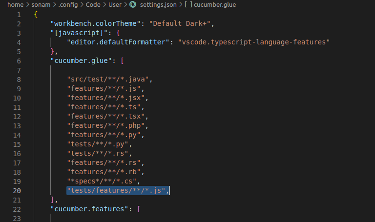
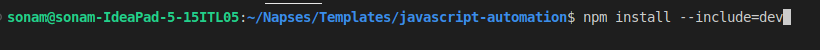
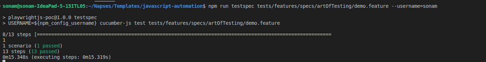

## Automation Tools used:
 1) Web Automation : Playwright 
 2) Mobile Automation : Appium

# System Setup : 

    - Install nvm : https://github.com/nvm-sh/nvm 
    - Install node : node 18.0 :
        - open terminaland run the following command :  nvm install 18.0
    - install vs code https://code.visualstudio.com/download


# VS Code extension
1) cucumber

    code --install-extension cucumberopen.cucumber-official
    
    add "tests/features/**/*.js" in cucumber:glue --extensions setting



## Steps to run demo test case
    1. Clone the project using command "git clone git@bitbucket.org:peoppl_co/javascript-automation.git"

    2. run command "npm install --include=dev" to install all the dependencies


    3. npx playwright install 

    4. run the test case using commmand "npm run watch"



    4. check the test report in reports folder

    5. check the screenshot in screenshots folder

    6. press ctrl+c in the terminal to stop the test

## Understanding cucumber 
    1. Features files 
    2. Cucumber steps 
    3. Locators 

## Explain Napses Framework 

## Steps to create a testcase
    1. Create feature file in specs folder

    2. Mention the feature name and the scnario name

    3. Store the locators in "resources/locator.js" file
    
    4. Add the steps to the Scenario. Try using the steps from steps mentioned in predefined steps.
        (For web application the first step of the first scenario should be "Given user is on web app")
        (For mobile application the first step of the scenario should be "Given user is on mobile app")

    5. Add step defintions to the steps which are not already defined in the step.js file

    6. Store test data in "tests/data/user-data/default.json" file or specific user file
       (Data can be hard coded or randomly generated data can also be used)

    7. Run your test using following command
        npm run test --username=sonam

        To pick data from default.json skip the username
        npm run test 

        To run a specific feature file use
        npm testspec relative_path_of_feature_file --username=sonam


 
## Usage

### Running Web Test Cases


To run web test cases, follow these steps:

```Given User is on web app```

This step initializes the driver for the web test case.

### Running Mobile Test Cases

To run mobile test cases, follow these steps:

Initialize the mobile driver by executing the following step at the beginning of your scenario:

```Given User is on mobile app```

This step initializes the driver for the mobile test case.


# FactoryGirl for Test Data Generation

## Overview
FactoryGirl is a powerful tool for generating test data in your test suites. This document outlines how to define and use test data using FactoryGirl in your test flows.

## Default Data
Default data is defined in the `test/data/user-data/default.json` file. This file contains data that serves as a fallback for test flows.

## User-Specific Data
You can also define user-specific data by creating JSON files with names like `user.json`, `user1.json`, etc. This data takes priority over the default data for the respective users.

### Data Priority Order
The data priority order is as follows:
1. User Data  
2. Default Data
3. Factory Data (Defined in `factory.js`)

### FactoryGirl Syntax
In your test steps, FactoryGirl syntax allows you to generate random or predefined data efficiently. Here's how you can use it:

- `$user.email`: Generates a random email defined in the factory model for the user.
- `$user_1.email`: Stores a random email for future use in the test flow for another user.
- `$user_test_flow.user_1.email`: Stores an email in the provided namespace for later access in the test flow specific to the user.

You can also use hard-coded values:

- `"email@email.com"`: Hard-coded value.

Additionally, you can nest namespaces for better organization:

- `$user_test_flow.user_test_flow1.user_test_flow2.user_1.email`: Stores an email in the provided namespace for later access in the test flow.

### Usage with Command Line
You can define the username by passing it as an argument to the `npm test` command. For example:

```bash
npm test --username=user


### Tools needed 
Install SelectorsHub Chrome extension : https://chromewebstore.google.com/detail/selectorshub/ndgimibanhlabgdgjcpbbndiehljcpfh?hl=en

### Implentation of tests with out restarting the browser

Note : Make sure you close all the chrome instance , before starting chrome in debug mode.

### Ubuntu 
    /usr/bin/google-chrome-stable --remote-debugging-port=9222
    
    Note : we are using port 1234 in this project for remote debugging


### Mac 
    /Applications/Google\ Chrome.app/Contents/MacOS/Google\ Chrome --remote-debugging-port=1234


# Appium Setup
 install appium -> npm install appium -g
#  Run appium -> 
 appium --base-path /wd/hub
#  Run emulator 
 ~/Library/Android/sdk/emulator/emulator --avd Pixel_3a_API_34_extension_level_7_arm64-v8a
#  Launch inspector  and add the below as capablities 
{
  "platformName": "Android",
  "appium:appPackage": "com.napses.drlpsoriasis.qa",
  "appium:deviceName": "emulator-5554",
  "appium:app": " /Users/praveen/Downloads/Psoriasis_QA_0.0.9+1.apk",
  "appActivity": "MainActivity"
}

#Points to remember for flutter test 
- To enter text into text box, we need to click on the text box and then enter the value.
    - When we inspect the text box using the ui inspect you will get xpath //android.view.View[@text="login_mobile_number_field"], where the element is a view.
    - This element should be used for clicking it and change the it to //android.widget.EditText[@text='login_mobile_number_field'] to eneter the text.
    - So we need to have two selectors one for clicking and one for enetering the text
    /Applications/Google\ Chrome.app/Contents/MacOS/Google\ Chrome --remote-debugging-port=1234
